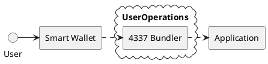
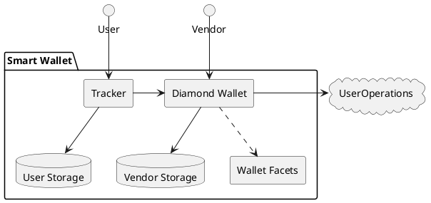
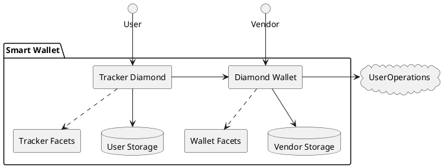

# Centralized upgrades

intended for mass management of ERC 4337 smart wallets

## Context

If we represent the authority of individuals on chain using programable wallets for the "next billion web3 users" how are we going to cope when we need to patch all those wallets for a security vulnerability ?

If we want user wallets to enable rich application specific behaviour how are we going to accomplish that composeability on chain ?

### Problem 1: user apathy vs security

When a smart wallet implementation needs to be upgraded for a vulnerability, requiring the smart wallet owners to perform the upgrade will lead to most smart wallets never being upgraded.

### Problem 2: operational cost to perform upgrades

Even if a smart wallet vendor was technically able to upgrade millions (or possibly billions) of smart wallet accounts on behalf of their owners, doing so would be prohibitively expensive.
 
### Use Case 1: user accounts for games

The game(s) is/are an independent diamond system

The wallet is an EIP 4337 smart account using Tracker to follow a wallet implementation that is 

## Tracker

We use the [diamond][ERC-2535] standard to make a composable and extensible wallet.

We use the [beacon proxy][ZEP-BEACON] model to indirect access to the wallet implementation. This is a _double_ proxy: the tracker follows the wallet implementation. The wallet implementation is itself a Diamond proxying to Facet contracts.

If we followed the zepplin nomenclature we would re-name the reference Diamond to be DiamondBeacon. This seems un-necessarily confusing to people who have absorbed the Diamond standard. So we formalise from the other end of the relation ship - the contract that *follows* the beacon is the **Tracker**

## Smart Wallet interacts with Application (eg a Game)

The user sees the address of the **Tracker** as their Smart Wallet address. Every user has their own address. Each user tracker follows a *vendors* Diamond Wallet implementation. **Governance** between the user and wallet vendor is defined by the specific implementation facets.

At this point, the Tracker is a simple proxy. Creating a double proxy via Diamond Wallet. The wallet vendor can interact with the Diamond Wallet to perform upgrades, and all Trackers following that wallet implementation will 'track' that implementation automatically.

I think of the Tacker, with an ERC 4337 implementation, as my **diamond hands**

Notice that while the Application may also be a Diamond, there is no requirement for it to be so. Its implementation is completely outside the scope of the wallet **unless* the wallet vendor is specifically choosing to design the wallet around that application.

This repository stops at this point. The Tracker is implemented as a simple proxy for the Diamond. To provide for per user (and user managed) wallet extensibility, the Tracker could itself be a Diamond. This is the Double Diamond topology

However, this likely requires significantly more involved fallback and louper method implementations on the Tracker Diamond. This topology is likely required in order to enable facet by facet 'opt outs' in the smart wallet.

## What does the user see ?

* A wallet address through which they interact with one or more application addresses
* Their personal 'wallet' state
* There 'owned' application state, authorized to their wallet address
* Upgrades to wallet features are automatic
* If the Tracker Diamond is in play
  * some kind of opt in/out mechanism
  * personalisable wallet implementation
* The likely variance in wallet governance implies that users will have many smart wallets.

## Governance

This indirection necessarily places trust in the wallet vendor. It is for the vendor to define the governance in such that it is acceptable to users of the applications

### Application specific smart wallets

Each application defines an application specific wallet and on boards users with a deployment of a tracker wallet for each application user. The application is the vendor and manages upgrades of the user smart wallet.

The user must decide if they trust the governance rules of the diamond wallet put in place by the application developer.

### Platform specific smart wallets

A common platform implements smart wallet behaviour on behalf of many dapps. Each user is onboarded to the platform and configures one or more dapps supported by that platform. The platform is the vendor and manages upgrades of user smart wallets on behalf of both users and dapp developers.

The user must decide if they trust the governance rules of the diamond wallet put in place by the platform developer.

### Distributed Governance

There is no central vendor for the smart wallet implementation

## References

* [ERC-2535]: https://eips.ethereum.org/EIPS/eip-2535/
    [Diamonds][ERC-2535]
* [ERC-4337]: https://eips.ethereum.org/EIPS/eip-4337/
    [ERC 4337 Account Abstraction][ERC-4337]
* [ZEP-BEACON]: https://github.com/OpenZeppelin/openzeppelin-contracts/blob/master/contracts/proxy/beacon/BeaconProxy.sol
    [OpenZeppelin Beacon Proxy][ZEP-BEACON]